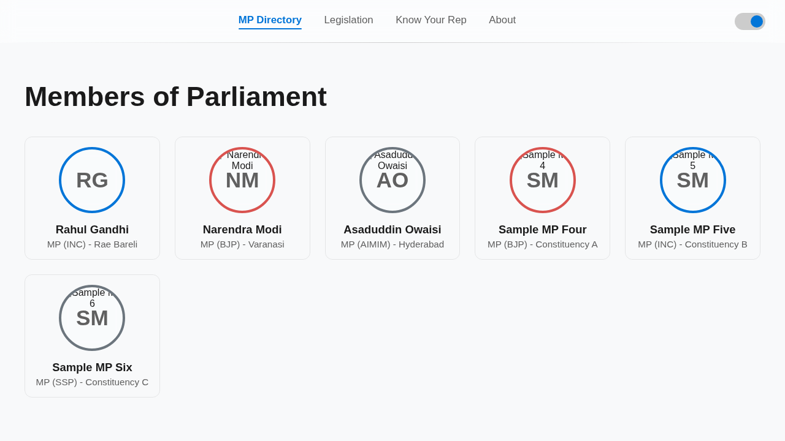
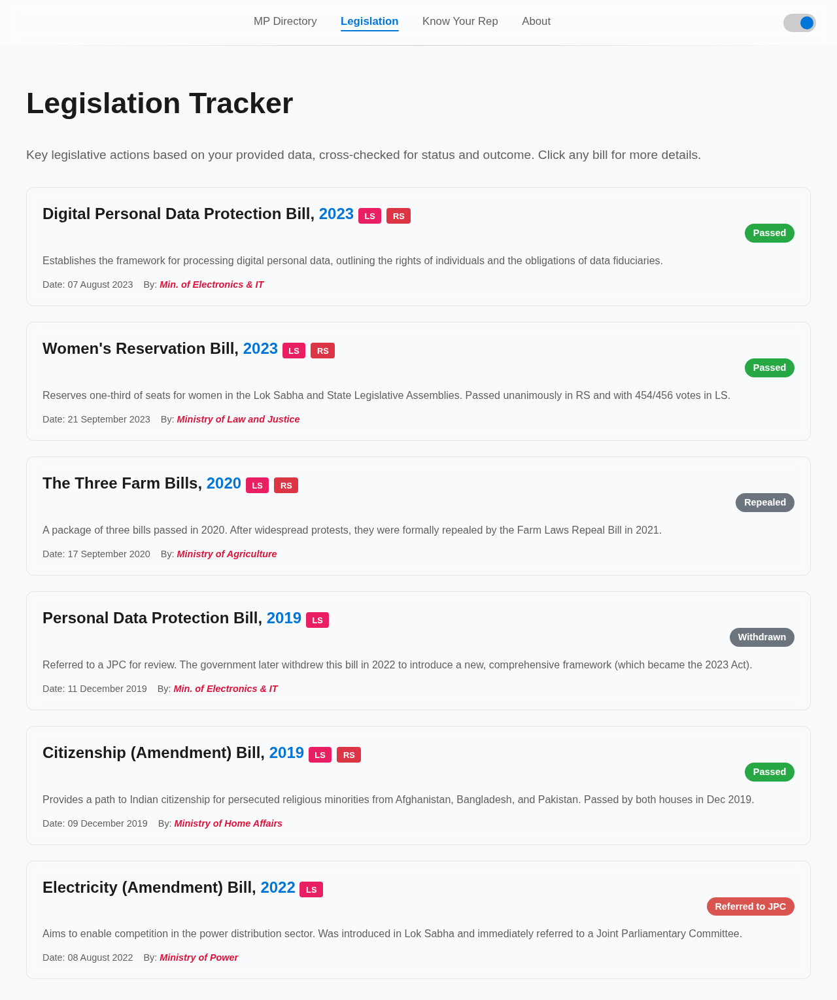
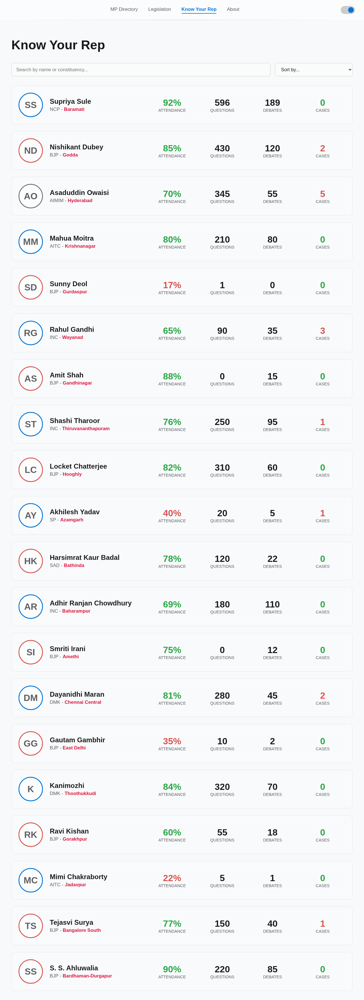
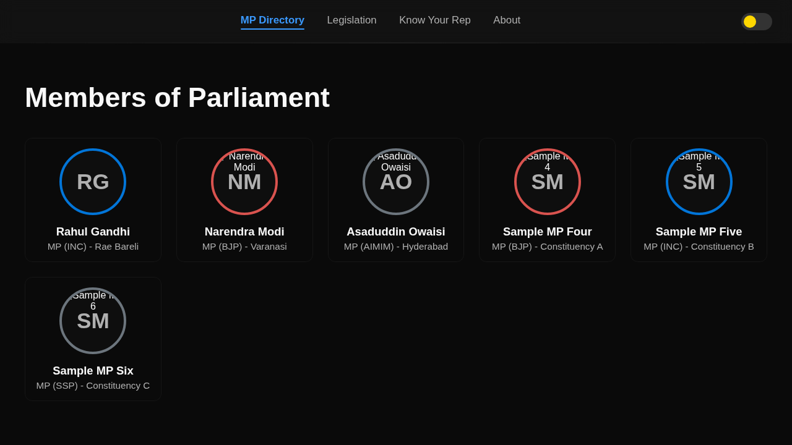

# MP Tracker - Indian Parliamentary Tracker 🇮🇳

[](LICENSE)
[]()
[](https://anacondy.github.io/MP-tracker-site-/)

A modern, transparent, and user-friendly web application for tracking Indian Members of Parliament (MPs), their performance, and legislative activities.

🌐 **Live Site**: [https://anacondy.github.io/MP-tracker-site-/](https://anacondy.github.io/MP-tracker-site-/)


## ✨ Features

### 🏛️ Core Functionality
- **MP Directory**: Browse through comprehensive profiles of Indian MPs
- **Legislation Tracker**: Track bills, amendments, and their status in Parliament
- **Know Your Rep**: Search and filter MPs by name, constituency, party, or alliance
- **Performance Metrics**: View attendance, questions asked, debates participated, and more

### 🎨 Design & UX
- **Dark/Light Mode**: Beautiful theme toggle with persistent preferences across pages
- **Frosted Glass UI**: Modern glassmorphism design with transparent, blurred backgrounds
- **Smooth Animations**: Fluid transitions and hover effects for enhanced user experience
- **Mobile Optimized**: Fully responsive design for 16:9 and 20:9 aspect ratio devices

### 🔒 Security & Privacy
- **Anonymous Browsing**: Trace ID system for anonymous user tracking
- **Content Security Policy**: CSP headers to prevent XSS attacks
- **Input Sanitization**: All user inputs are sanitized to prevent security vulnerabilities
- **No Personal Data Collection**: Privacy-first approach

### 💾 Technology
- **IndexedDB Integration**: Client-side database for efficient search and data management
- **Advanced Search**: Search by name, constituency, or party name
- **Progressive Enhancement**: Works even with JavaScript disabled for basic features
- **No External Dependencies**: Lightweight and fast-loading

### 📱 User Features
- **Feedback System**: Submit feedback, bug reports, and feature requests
- **About Page**: Learn about the project and its mission
- **Support Options**: Contribute, donate, or spread the word

## 🚀 Getting Started

### Prerequisites
- A modern web browser (Chrome, Firefox, Safari, or Edge)
- A local web server (optional, for development)

### Installation

1. **Clone the repository**
```bash
git clone https://github.com/anacondy/MP-tracker-site-.git
cd MP-tracker-site-
```

2. **Open in browser**
```bash
# Using Python 3
python3 -m http.server 8000

# Using Node.js http-server
npx http-server -p 8000

# Or simply open index.html in your browser
```

3. **Navigate to**
```
http://localhost:8000
```

## 🆕 Recent Updates (November 2024)

### Performance Enhancements
- ✅ Reduced animation transition times from 0.4s to 0.25-0.3s for snappier feel
- ✅ Added GPU acceleration with `will-change` and `backface-visibility` CSS properties
- ✅ Optimized theme switching for instant visual feedback
- ✅ Improved card hover effects with hardware-accelerated transforms

### Mobile Responsive Improvements  
- ✅ Enhanced spacing and padding across all breakpoints (768px, 480px)
- ✅ Better navbar layout with flexbox optimization for mobile
- ✅ Specific optimizations for 20:9 aspect ratio devices
- ✅ Single-column layout for devices <480px width
- ✅ Improved touch targets and interactive elements
- ✅ Better font sizing and line heights for readability

### AI Integration Enhancements
- ✅ Completely rewritten Gemini API prompt with structured requirements
- ✅ Added explicit trusted source requirements
- ✅ Specified exact data field requirements and formats
- ✅ Quality control guidelines for data completeness
- ✅ Enhanced OpenAI integration with matching prompt structure
- ✅ Temperature control (0.2) for factual accuracy

### Code Quality
- ✅ Added comprehensive JSDoc comments to all database functions
- ✅ Improved inline comments throughout codebase
- ✅ Better function documentation with parameter types
- ✅ Enhanced code organization and structure

## 📂 Project Structure

```
MP-tracker-site-/
├── index.html              # MP Directory (Home page)
├── legislation.html        # Legislation tracker
├── legislation_detail.html # Bill details page
├── know_your_rep.html      # Search and filter MPs
├── about.html              # About page with feedback form
├── styles/
│   ├── main.css           # Main styles and layout
│   ├── themes.css         # Dark/Light theme variables
│   └── about.css          # About page specific styles
├── scripts/
│   ├── main.js            # Theme toggle and trace ID
│   ├── filter.js          # MP filtering and sorting
│   ├── database.js        # IndexedDB implementation
│   └── about.js           # Feedback form handling
├── LICENSE                # MIT License
└── README.md             # This file
```

## 🎯 Pages Overview

### 🏠 MP Directory (index.html)
Browse through MP profiles with photos, party affiliations, and constituencies.



### 📜 Legislation (legislation.html)
Track important bills and legislation with status indicators.



### 🔍 Know Your Rep (know_your_rep.html)
Search and filter MPs with advanced sorting options.



### ℹ️ About (about.html)
Learn about the project, submit feedback, and support the initiative.

## 📸 Site Features

### Dark Mode Theme


The site features a beautiful dark mode with glassmorphism effects, golden glow on borders, and smooth transitions. The toggle switch shows a golden/yellow crown in dark mode.

### Light Mode Theme


Switch seamlessly to light mode for comfortable daytime browsing. Features blue glow effects on borders and a blue toggle switch crown.

### Theme Detection
The site automatically detects your system's theme preference (dark/light mode) and applies it on first visit. Your manual theme choice is saved and persists across pages.

### Responsive Design
Fully optimized for mobile devices with 16:9 and 20:9 aspect ratios.

### Search & Filter


Advanced search and filtering capabilities to find MPs by name, constituency, or party.

## 🌈 Theme System

The site supports both dark and light modes with smooth transitions:

- **System Detection**: Automatically detects your device's theme preference on first visit
- **Dark Mode**: Deep blacks with golden glow effects and yellow toggle crown
- **Light Mode**: Clean whites with blue glow effects and blue toggle crown  
- **Persistent**: Manual theme choice is saved and persists across pages
- **Smooth Transitions**: 0.3s ease transitions for comfortable viewing
- **Visual Separators**: Subtle separator lines between content sections
- **Border Glow Effects**: Golden glow in dark mode, blue glow in light mode for better visibility

## 🔍 Search Features

### Advanced Search Capabilities
- Search by **MP Name**: Find specific representatives
- Search by **Constituency**: Discover MPs from your area
- Search by **Party Name**: Filter by political affiliation
- **Universal Search**: Searches across all fields simultaneously

### IndexedDB Integration
- Client-side database for faster searches
- Offline capability for previously loaded data
- Efficient indexing for quick results

## 🛡️ Security Features

### Implemented Protections
1. **Content Security Policy (CSP)**: Prevents XSS attacks
2. **Input Sanitization**: All user inputs are sanitized
3. **No Inline Event Handlers**: Secure JavaScript execution
4. **Anonymous Tracking**: Privacy-preserving trace IDs
5. **HTTPS Ready**: Secure communication ready

## 🎨 Design Philosophy

### Visual Design
- **Glassmorphism**: Frosted glass effects with backdrop blur for modern aesthetic
- **Color Consistency**: Carefully chosen color palettes optimized for both themes
- **Typography**: Inter font family for clean, highly readable text across all devices
- **Spacing**: Generous whitespace for comfortable reading and reduced eye strain
- **Performance First**: Optimized CSS with hardware acceleration for smooth animations

### User Experience
- **Mobile First**: Designed and optimized for touch devices from the ground up
- **Progressive Disclosure**: Information revealed progressively as needed
- **Instant Feedback**: Visual feedback for all user interactions
- **Accessibility**: Semantic HTML and ARIA labels for screen reader compatibility
- **Smooth Animations**: GPU-accelerated transitions (0.25-0.3s) for fluid feel

## 📱 Mobile Optimization

The site is fully optimized for mobile devices with responsive design across all screen sizes:

### Responsive Breakpoints
- **Desktop**: 1200px+ (Full multi-column layout)
- **Tablet**: 768px - 1199px (Adapted layout with adjusted spacing)
- **Mobile**: <768px (Stacked layout with optimized touch targets)
- **Small Mobile**: <480px (Single column with enhanced readability)

### Device Support
- ✅ 16:9 aspect ratio (standard smartphones)
- ✅ 20:9 aspect ratio (modern tall smartphones with extra optimizations)
- ✅ Tablet devices (both portrait and landscape)
- ✅ Desktop browsers (all standard resolutions)

### Mobile-Specific Enhancements
- **Improved Touch Targets**: All buttons and links sized appropriately for finger taps
- **Optimized Spacing**: Enhanced padding and margins for better readability
- **Flexible Navigation**: Navbar adapts to mobile with stacked layout
- **Responsive Cards**: MP and legislation cards adjust size and layout
- **Better Typography**: Font sizes optimized for each breakpoint
- **Efficient Stats Display**: 2-column grid layout for statistics on mobile
- **Single Column When Needed**: Cards stack vertically on very small screens (<480px)

## 🤝 Contributing

We welcome contributions! Here's how you can help:

1. **Report Bugs**: Use the feedback form on the About page
2. **Suggest Features**: Share your ideas through feedback
3. **Submit Pull Requests**: Fork, improve, and submit PRs
4. **Improve Documentation**: Help make the docs better
5. **Share**: Spread the word about MP Tracker

### Development Guidelines
- Follow existing code style and conventions
- Test on multiple browsers before submitting
- Ensure mobile responsiveness
- Maintain theme consistency
- Add comments for complex logic

## 🗺️ Roadmap

### Current Features ✅
- ✅ MP Directory with photos and basic information
- ✅ Legislation tracker
- ✅ Advanced search and filtering
- ✅ Dark/Light mode with theme persistence
- ✅ Anonymous trace IDs for privacy
- ✅ Feedback submission system
- ✅ Mobile-responsive design
- ✅ Glassmorphism UI design

### Upcoming Features 🚀
- [ ] **AI-Powered Data Updates**: ✅ **IMPLEMENTED** - Enhanced prompts for Gemini/OpenAI API
- [ ] **Scheduled Updates**: ✅ **IMPLEMENTED** - Automatic data refresh at scheduled intervals
- [ ] **Enhanced Performance**: ✅ **IMPLEMENTED** - GPU-accelerated animations and optimized CSS
- [ ] **Mobile Optimization**: ✅ **IMPLEMENTED** - Comprehensive responsive design for all devices
- [ ] **Enhanced MP Profiles**: Complete attendance records, questions asked, debates participated
- [ ] **Criminal Case Tracking**: Transparency in MP criminal records with verified data
- [ ] **Performance Analytics**: Visual charts and performance metrics with interactive graphs
- [ ] **Real-time Notifications**: Alert users about important parliamentary activities
- [ ] **Comparison Tool**: Compare multiple MPs side-by-side with detailed metrics
- [ ] **Historical Data**: Track MP performance over time with trend analysis
- [ ] **Multi-language Support**: Hindi and regional language support for wider accessibility
- [ ] **PDF Export**: Generate downloadable MP reports for offline viewing
- [ ] **Email Notifications**: Subscribe to bill updates and MP activity alerts
- [ ] **Data Verification**: Multi-source verification before displaying information
- [ ] **Interactive Animations**: Enhanced user experience with subtle, smooth animations

### In Development 🔨
- ✅ **Performance Optimizations** - COMPLETED: Faster animations, GPU acceleration, optimized CSS
- ✅ **Mobile Responsive Enhancements** - COMPLETED: Improved spacing, better breakpoints, touch-optimized
- ✅ **Enhanced AI Prompts** - COMPLETED: Detailed data collection instructions for better accuracy
- ✅ **Code Documentation** - COMPLETED: Comprehensive comments and JSDoc annotations
- AI data validation system with multi-source verification
- Automated quality checks for MP information accuracy
- Source verification from multiple trusted databases

## 🤖 AI-Powered Data Updates

MP Tracker supports automated data gathering using Gemini or OpenAI API with enhanced prompts for accurate data collection. The system:

### Features
- **Multi-Source Verification**: Gathers MP/MLA information from trusted government and NGO sources
- **Quality Validation**: Validates data from multiple sources before adding (minimum 2 sources required)
- **Complete Profiles**: Ensures complete profiles with at least 5/7 required data fields
- **Scheduled Updates**: Runs scheduled updates at 3:07 AM daily for fresh data
- **Visual Feedback**: Shows a haunted pumpkin animation during updates 🎃
- **Smart Error Handling**: Retries failed updates and logs errors for debugging

### Enhanced AI Prompts
The system now uses sophisticated prompts with:
- **Structured Data Requirements**: Exact field specifications for consistent data
- **Source Verification**: Explicit requirement for trusted sources only
- **Quality Guidelines**: Minimum data completeness and accuracy standards
- **Focus Areas**: Prioritizes high-interest MPs and diverse representation
- **Output Format Control**: Ensures pure JSON responses without markdown

### Trusted Data Sources
- loksabha.gov.in (Lok Sabha official website)
- rajyasabha.gov.in (Rajya Sabha official website)  
- myneta.info (Association for Democratic Reforms)
- prsindia.org (PRS Legislative Research)
- eci.gov.in (Election Commission of India)

**For detailed setup instructions, see [API_INTEGRATION_GUIDE.md](API_INTEGRATION_GUIDE.md)**

### Quick Setup
```javascript
// Set your API key in browser console
localStorage.setItem('gemini_api_key', 'YOUR_API_KEY');
// or
localStorage.setItem('openai_api_key', 'YOUR_API_KEY');

// Test the pumpkin animation
window.aiDataManager.performDataUpdate();
```

## 📄 License

This project is licensed under the MIT License - see the [LICENSE](LICENSE) file for details.

## 🙏 Acknowledgments

- Data sources: Lok Sabha and Rajya Sabha official records
- Design inspiration: Modern web design principles
- Community: Thanks to all contributors and users

## 📞 Contact & Support

- **Feedback**: Use the feedback form on the About page
- **Issues**: Report bugs through GitHub Issues
- **Email**: anujmeena2025@gmail.com
- **GitHub**: [@anacondy](https://github.com/anacondy)
- **Live Site**: [https://anacondy.github.io/MP-tracker-site-/](https://anacondy.github.io/MP-tracker-site-/)

## 🌟 Star History

If you find this project useful, please consider giving it a star! ⭐

---

**Made with ❤️ for Indian democracy and transparency**


